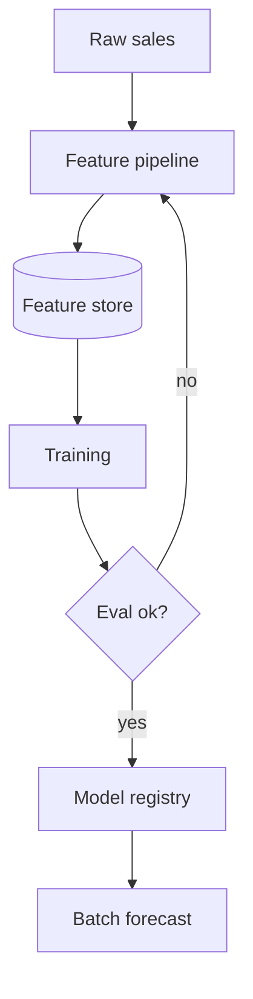
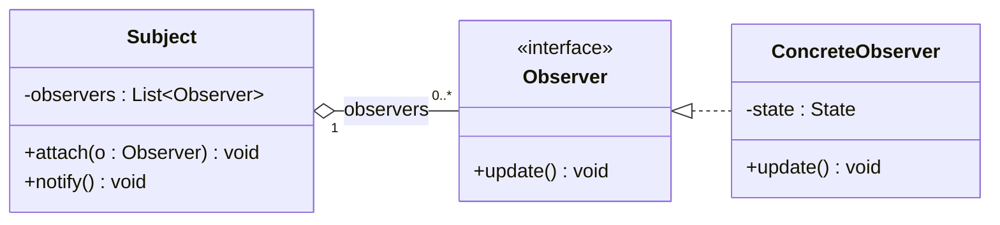

Reply with exactly the two mermaid code blocks below, copied verbatim, and nothing else. Do not use any tools.

```mermaid
%% title: Tall flow
flowchart TD
  A[Raw sales] --> B[Feature pipeline]
  B --> C[(Feature store)]
  C --> D[Training]
  D --> E{Eval ok?}
  E -- yes --> F[Model registry]
  E -- no --> B
  F --> G[Batch forecast]
```

```mermaid
%% title: Wide classes
classDiagram
  direction LR
  class Subject {
    -observers : List~Observer~
    +attach(o : Observer) void
    +notify() void
  }
  class Observer {
    <<interface>>
    +update() void
  }
  class ConcreteObserver {
    -state : State
    +update() void
  }
  Subject "1" o-- "0..*" Observer : observers
  Observer <|.. ConcreteObserver
```
